# Ghidul panoului de administrare

Panoul e făcut în primul rând pentru telefon: îl poți folosi pe teren, între două antrenamente.
Adresa este `https://numele-clubului.ro/admin`. Capturile de mai jos sunt făcute pe un telefon; pe
calculator, meniul stă în stânga.

**Sfat:** adaugă panoul pe ecranul principal al telefonului (Safari: Partajează → Adaugă pe ecranul
principal; Chrome: ⋮ → Adaugă pe ecranul de pornire). Rămâi autentificat 30 de zile.

Cuprins: [Autentificare](#autentificare) · [Tabloul de bord](#tabloul-de-bord) ·
[Azi](#azi) · [Rezervări](#rezervări) · [Disponibilitate](#disponibilitate) ·
[Conținut](#conținut) · [Echipa](#echipa-de-antrenori) · [Academia de juniori](#academia-de-juniori) ·
[Fotografii și video-uri](#fotografii-și-video-uri) · [Mesaje, evaluări și lista de așteptare](#mesaje-evaluări-și-lista-de-așteptare) ·
[Clienți](#clienți) · [Newsletter](#newsletter) · [Campanii](#campanii) ·
[Asistentul AI](#asistentul-ai) · [Setări și conturi](#setări-și-conturi) ·
[Jurnal](#jurnal) · [Dacă ceva nu merge](#dacă-ceva-nu-merge)

---

## Autentificare

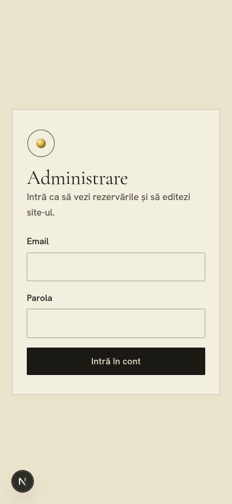

Intri cu emailul și parola contului tău. După 5 parole greșite, contul se blochează 15 minute (e
o protecție împotriva celor care ghicesc parole). Dacă ai uitat parola, cine administrează serverul
o schimbă cu o singură comandă (vezi `DEPLOY.md`, pasul 9).

Parola ți-o schimbi din **Contul meu**. Tot acolo poți **deconecta celelalte dispozitive**, de
exemplu dacă ți-ai pierdut telefonul.

## Tabloul de bord

Cât timp site-ul nu e complet, sus apare **Pregătirea site-ului**: ce mai trebuie de la club
(video-ul de deschidere, logoul, fotografiile antrenorilor, programul și taxa grupelor, tarifele,
galeria, datele legale, verificarea paginilor legale). Fiecare punct duce direct unde se
completează; lista dispare când totul e gata.

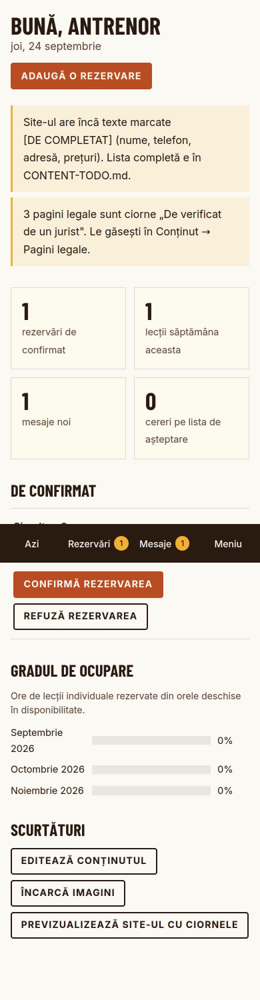

Prima pagină după autentificare:

- **avertismente** în chenar auriu: ce lipsește ca site-ul să fie complet (email pentru notificări,
  texte `[DE COMPLETAT]`, pagini legale neverificate);
- **patru cifre**: rezervări care așteaptă confirmarea, lecțiile săptămânii, mesajele noi, cererile
  de pe lista de așteptare. Fiecare cifră deschide lista respectivă;
- **De confirmat**: rezervările noi, cu butoanele de confirmare direct acolo;
- **Gradul de ocupare** pe trei luni: cât din timpul deschis pentru rezervări e ocupat;
- scurtături: editează conținutul, încarcă imagini, **previzualizează site-ul cu ciornele**.

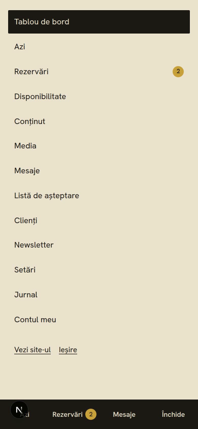

Jos ai mereu **Azi**, **Rezervări**, **Mesaje** și **Meniu** (toate secțiunile). Bulina aurie arată
câte lucruri noi te așteaptă.

## Azi

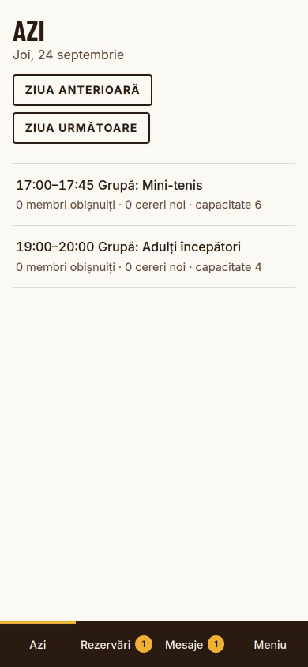

Lecțiile zilei, în ordine, cu numele elevului (sau al copilului și vârsta), programul și butoanele
**Sună** și **WhatsApp** (mesajul e deja scris, cu codul rezervării). Treci la ziua anterioară sau
următoare cu butoanele de sus. După lecție, apasă **Marchează efectuată** sau **Neprezentare**.
Ședințele de grupă apar cu numărul de locuri ocupate.

## Rezervări

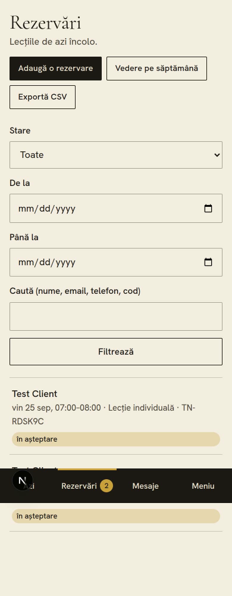

- **Filtre**: stare, interval de date, căutare după nume, email, telefon sau cod (ex. `TN-4K7Q2M`).
- **Vedere pe săptămână**: calendarul săptămânii, cu intervalele libere în verde deschis.
- **Exportă CSV**: descarcă lista (se deschide direct în Excel).

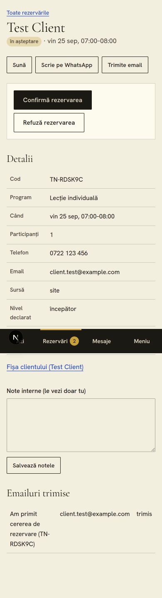

Deschizi o rezervare ca să vezi toate detaliile (inclusiv mesajul clientului, data acordului GDPR și
emailurile trimise) și să alegi ce faci:

| Buton | Ce se întâmplă |
| --- | --- |
| **Confirmă rezervarea** | Clientul primește emailul de confirmare, cu fișierul pentru calendar (.ics). Cu o zi înainte primește automat un memento. |
| **Refuză rezervarea** | Poți scrie un motiv (apare în emailul către client). Intervalul se eliberează. |
| **Anulează rezervarea** | La fel, pentru o rezervare deja confirmată. |
| **Marchează efectuată** | Lecția intră în istoric; dacă clientul are pachet, scade o lecție. După prima lecție efectuată, clientul primește (o singură dată, la două ore) invitația de a lăsa o recenzie. |
| **Neprezentare** | Pentru evidența ta; clientul nu primește nimic. |

**Note interne**: le vezi doar tu (de exemplu „accidentare veche la umăr”).

Poți confirma și **direct din emailul** pe care îl primești la fiecare rezervare nouă: butoanele
din email funcționează fără autentificare, timp de 7 zile.

Dacă alegi în Setări modul **Instant**, rezervările se confirmă singure și primești doar
notificarea.

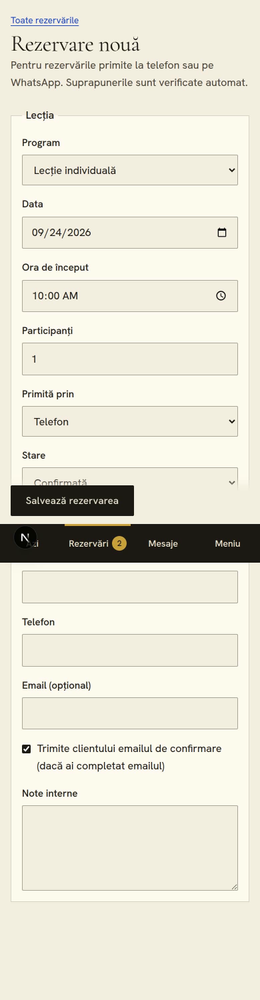

**Adaugă o rezervare** (butonul de sus): pentru cei care te sună sau îți scriu pe WhatsApp. Alegi
programul, ziua și ora, completezi numele și telefonul (emailul e opțional). Site-ul verifică să
nu se suprapună cu altă lecție și, dacă există email, poate trimite confirmarea.

## Disponibilitate

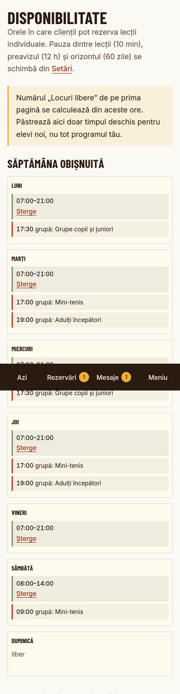

Aici spui **când pot rezerva clienții de pe site**:

- **Intervale săptămânale**: de exemplu luni–vineri 16:00–20:00. Poți bifa mai multe zile odată și
  poți limita intervalul la o perioadă (de exemplu doar vara).
- **Excepții**: **concediu sau zi liberă** (blocat, pe o zi sau pe mai multe zile la rând) sau **ore
  în plus** (disponibil extra). Dacă blochezi o zi în care ai deja rezervări, pagina te avertizează
  (rezervările existente nu se anulează singure).

Site-ul lasă automat pauza dintre lecții (implicit 10 minute), nu acceptă rezervări cu mai puțin
de 12 ore înainte și nici mai departe de 60 de zile. Le schimbi în **Setări → Rezervări**.

Programul grupelor academiei de juniori (zile, ore, taxă) nu ține de disponibilitate: se scrie în
**Conținut → Grupele academiei de juniori**.

## Conținut

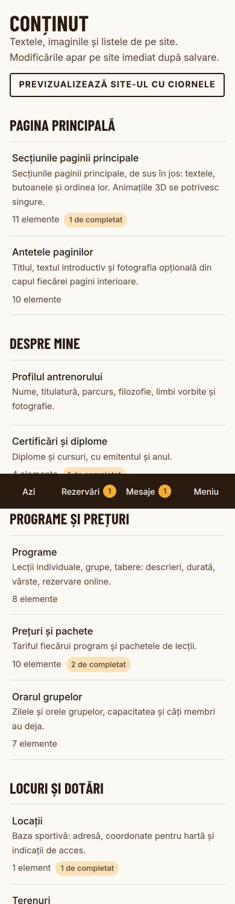

Orice text, fotografie sau video de pe site se schimbă de aici, fără cod: secțiunile paginii
principale, antetele paginilor, echipa de antrenori și certificările lor, grupele și rezultatele
academiei de juniori, programele, tipurile de lecții, prețurile și pachetele, locațiile, terenurile,
facilitățile, întrebările frecvente, recenziile, galeria, articolele și paginile legale. Eticheta **„de completat”** arată unde mai e `[DE COMPLETAT]`.

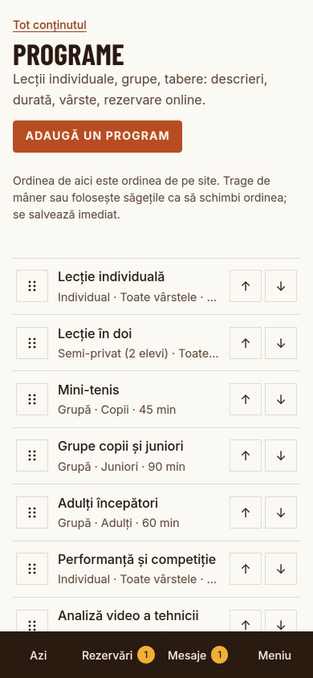

**Ordinea de pe site** se schimbă trăgând de mânerul din stânga (cu degetul: ține apăsat o clipă,
apoi trage) sau cu săgețile ↑ ↓. Se salvează imediat.

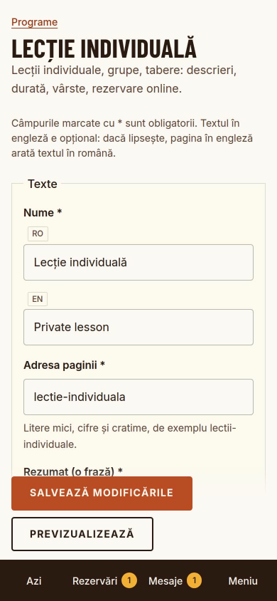

Fiecare text are două câmpuri: **RO** (obligatoriu) și **EN** (opțional; dacă lipsește, pagina în
engleză arată textul în română). Câmpurile cu steluță sunt obligatorii; dacă lipsește ceva,
mesajul spune exact ce și unde, iar ce ai scris rămâne în formular.

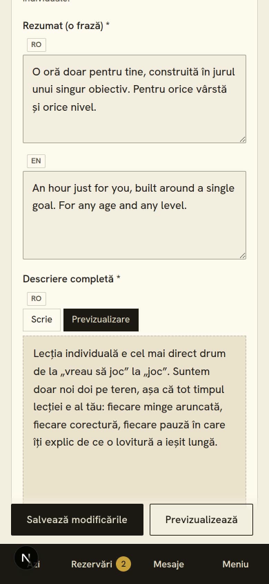

Textele lungi (descrieri, articole, pagini legale) acceptă formatare simplă:

| Scrii | Pe site apare |
| --- | --- |
| `**important**` | **important** |
| `*accent*` | *accent* |
| `## Titlu` pe un rând separat | un subtitlu |
| `- ` la începutul rândului | o listă |
| `[textul linkului](https://adresă)` | un link |

Apasă **Previzualizare** ca să vezi textul exact cum apare pe site.

**Previzualizează** (lângă Salvează) deschide pagina de pe site așa cum arată cu ciornele (articole
nepublicate, programe inactive). O bandă sus îți amintește că ești în previzualizare; o închizi de
acolo.

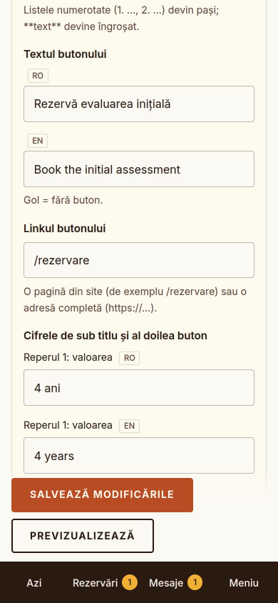

**Secțiunile paginii principale** (Conținut → Secțiunile paginii principale) au eticheta mică de
deasupra titlului, titlul, textul și butonul; le poți ascunde sau reordona. Unele au și texte
proprii:

- **Deschiderea**: textul celui de-al doilea buton (duce la Academia de juniori) și nota afișată
  până încarci video-ul. Titlul se împarte pe rânduri după fiecare propoziție („Învață. Joacă.
  Concurează.”). **Video-ul și fotografia** de deschidere se aleg din **Setări → Deschiderea
  paginii principale**;
- **Cifrele clubului**: doar titlul; numerele (terenuri, terenuri acoperite, vârsta de start,
  programe, antrenori) se calculează singure din conținut;
- **Academia de juniori**: linkul spre pagina academiei; etapele vin din grupe;
- **Echipa**: nota din ramele fără fotografie;
- **Baza sportivă**: nota din cadru; fotografia e cea din **Antetele paginilor → Clubul**;
- **Galerie**: textul afișat până publici fotografii; pe pagina principală apar primele 6.

În textul secțiunii „Metoda”, o listă numerotată (`1. **Titlu.** text`) devine pașii afișați pe
site.

**Articolele** (Sfaturi) rămân ciorne până alegi „Publicat”. **Paginile legale** primesc automat o
versiune nouă (data zilei) când le schimbi textul, pentru că fiecare acord salvat la rezervări și
mesaje păstrează versiunea politicii în vigoare.

## Echipa de antrenori

**Conținut → Echipa de antrenori**: fiecare antrenor are pagina lui pe site (`/echipa/nume`), cu
rolul în echipă („Antrenor principal”, „Antrenor academia de juniori”, „Preparator fizic”),
titulatura, un rezumat pentru card, parcursul, felul în care lucrează, specializările, limbile,
fotografia (vertical 4:5) și, opțional, un video. **Antrenorul principal** apare primul și
vorbește pentru academie; când bifezi alt antrenor ca principal, bifa se mută de la cel vechi.
Certificările fiecăruia se adaugă în **Conținut → Certificări și diplome**, alegând antrenorul.

## Academia de juniori

**Conținut → Grupele academiei de juniori**: pentru fiecare grupă, etapa (minge roșie,
portocalie, verde, galbenă), vârstele, ce lucrează copiii, **zilele și orele**, antrenamentele pe
săptămână și durata lor, **taxa lunară** (gol = „la cerere”) și numărul maxim de copii. Pe pagina
principală apar ca parcursul academiei; pe pagina Academia de juniori, fiecare cu detaliile ei.

**Conținut → Rezultate la turnee**: sportivul (la minori, doar prenumele și inițiala), turneul,
categoria, rezultatul, data și nivelul. Un rezultat al unui minor **nu se poate publica** fără bifa
„Am acordul scris al părinților”.

Părinții cer o **evaluare** din pagina academiei; cererea ajunge pe email și în **Evaluări și
așteptare**.

## Fotografii și video-uri

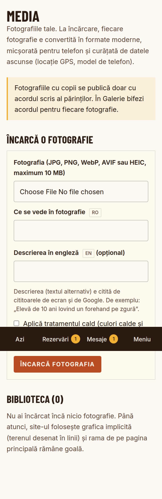

**Media** păstrează toate fotografiile și video-urile clubului. Alegi sus „O fotografie” sau
„Un video”. La încărcarea unei fotografii:

- se acceptă JPG, PNG, WebP, AVIF și HEIC (fotografiile de pe iPhone), până la 10 MB;
- **descrierea e obligatorie**: ce se vede în fotografie, pentru cei care nu văd imaginea și pentru
  Google (de exemplu „Elevă de 10 ani lovind un forehand pe zgură”);
- fotografia se micșorează pentru telefon, se convertește în formate moderne și se **curăță de
  datele ascunse** (locația GPS, modelul telefonului);
- bifa **„Aplică tratamentul cald”** dă fotografiilor culori ușor mai calde și granulație fină, ca
  să arate unitar pe paleta de zgură (nu o folosi pe fotografii deja editate).

La încărcarea unui **video** (MP4, MOV sau WebM, până la 500 MB și 3 minute):

- o bară arată cât s-a încărcat; nu închide pagina până la 100%;
- serverul îl convertește apoi pentru web (două mărimi, pentru telefon și ecran mare) și îi alege
  un cadru de previzualizare; durează de obicei 1–3 minute, iar pagina Media se actualizează
  singură când e gata. Din video se șterg datele ascunse (locația GPS);
- pe pagina principală video-ul e mut, pornește singur doar cât e pe ecran și are buton de pauză;
  în galerie pornește cu sunet, doar când apasă vizitatorul.

O fotografie sau un video folosit undeva pe site nu se poate șterge până nu îl înlocuiești acolo.

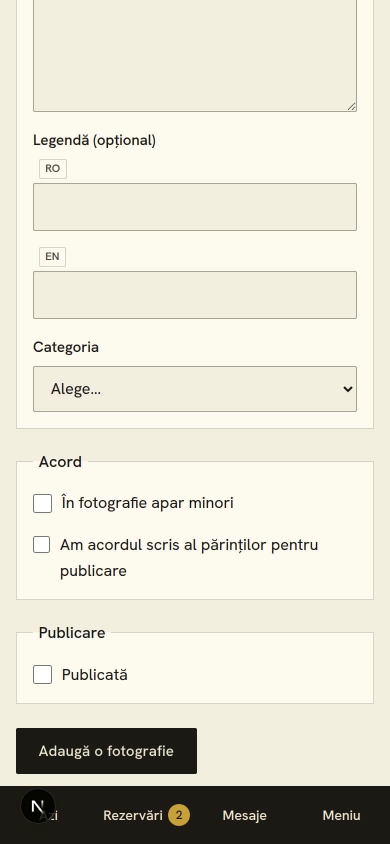

**Galerie foto și video**: dacă apar **copii**, bifează „Apar minori”. O astfel de fotografie sau
video **nu se poate publica** fără bifa „Am acordul scris al părinților”. Păstrează acordurile
scrise; data bifării se salvează.

La fel, o **recenzie** se publică doar cu acordul autorului.

## Mesaje, evaluări și lista de așteptare

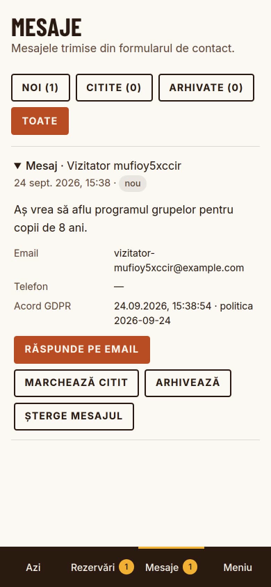

**Mesaje**: ce ți se scrie din formularul de contact. Răspunzi pe email, suni sau scrii pe WhatsApp
direct de aici, apoi marchezi mesajul **citit** sau îl **arhivezi**.

**Evaluări și așteptare**: cererile de evaluare pentru academia de juniori (copilul, vârsta, cât a
jucat, grupa dorită, zilele care le convin) și cei care vor un loc când se eliberează, în ordinea
înscrierii. Îi marchezi **contactat**, **înscris** sau **arhivat**.

## Clienți

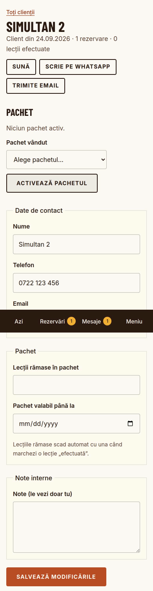

Fiecare client se creează automat la prima rezervare. Fișa lui are:

- **Pachet**: alegi pachetul vândut și apeși **Activează pachetul**; lecțiile rămase și data de
  expirare se completează singure și scad la fiecare lecție marcată efectuată;
- datele de contact și **note interne**;
- **istoricul** rezervărilor;
- **Datele personale (GDPR)**: dacă un client îți cere datele lui, apeși **Descarcă datele
  clientului** și îi trimiți fișierul. Dacă cere ștergerea, apeși **Șterge datele clientului**:
  rezervările rămân doar ca statistică (fără nume, telefon, email), iar mesajele, cererile și
  abonarea lui dispar.

Datele clienților mai vechi de 24 de luni se anonimizează automat (perioada se schimbă în Setări).

## Newsletter

Lista celor care s-au abonat din subsolul site-ului. Abonarea are **dublă confirmare** (abonatul
confirmă din email). **Descarcă lista (CSV)** îți dă adresele confirmate, fiecare cu linkul lui
personal de dezabonare, pentru serviciul de email pe care îl folosești (Brevo, Mailchimp).

## Campanii

Aici vezi **ce aduce fiecare reclamă și fiecare canal**: câte rezervări făcute pe site, cereri de
evaluare, înscrieri pe lista de așteptare și mesaje au venit din Facebook, Instagram, Google (din
reclame sau din căutare), de pe alte site-uri sau direct, în ultimele 30 sau 90 de zile ori într-un
an. Aceeași sursă o vezi și la fiecare rezervare, mesaj și cerere de evaluare („Venit din”), și în
emailul de anunț.

Ca o campanie să apară cu numele ei, folosește linkul făcut de **Link pentru o campanie**: alegi
pagina, unde apare linkul (Facebook, Instagram, afiș cu cod QR…) și un nume („inscrieri-toamna”),
apoi copiezi linkul în reclamă sau în postare. Reclamele Google Ads se recunosc și fără el.

Tabelul funcționează fără cookie-uri și fără conturi Google sau Meta. Dacă agenția care face
reclamele îți dă coduri de Google Analytics, Google Ads sau Meta Pixel, le pune cine administrează
serverul (vezi `DEPLOY.md`); atunci site-ul arată vizitatorilor bannerul de acord pentru cookie-uri,
iar lista „Instrumente de măsurare” de pe această pagină arată ce e activ.

## Asistentul AI

Butonul **Întrebări?** din colțul paginii deschide asistentul clubului. Răspunde vizitatorilor la
orice oră despre vârste, grupe, program, prețuri și rezervare, **doar din ce e publicat pe site**:
programele, lecțiile și tarifele, grupele academiei, echipa, întrebările frecvente, contactul și
setările de rezervare. Ce nu e completat (de exemplu o taxă lunară „[DE COMPLETAT]”) nu inventează:
spune că nu are informația și dă telefonul. Copiii îi trimite spre evaluare, adulții spre rezervare.

- Ca răspunsurile să fie bune, **completează conținutul**: tarifele lecțiilor, programul și taxa
  grupelor, întrebările frecvente. Asistentul vede orice modificare imediat.
- Conversațiile nu se salvează nicăieri; rămân doar în fereastra vizitatorului.
- Îl oprești din **Setări → Funcții → Asistentul AI de pe site**. Pe server are nevoie de o cheie
  Anthropic (`ANTHROPIC_API_KEY`); fără ea nu apare.

## Setări și conturi

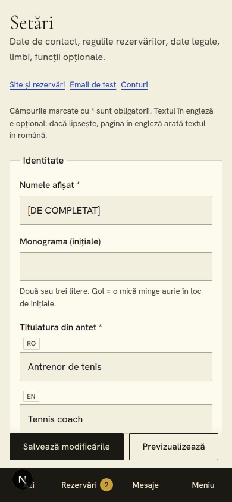

- **Identitatea clubului**: numele, descrierea de sub nume, **logoul** (PNG cu fundal transparent),
  monograma (până încarci logoul) și **cele două culori**: culoarea principală (baza închisă a
  designului) și accentul (butoane, linkuri). Restul nuanțelor se calculează din ele; o culoare
  prea deschisă pentru text alb e refuzată la salvare, cu explicația contrastului;
- **Deschiderea paginii principale**: video-ul și fotografia de deschidere;
- **Contact**: telefon, WhatsApp, email, rețele sociale;
- **Programul afișat** în subsol;
- **Rezervări**: modul (cerere sau instant), anularea gratuită, preavizul, orizontul, pauza dintre
  lecții, oferta pentru prima lecție, metodele de plată;
- **Date legale**: forma de organizare, denumirea, CUI, sediul (apar în subsol și în paginile legale);
- **Motoare de căutare**: titlul și descrierea pentru Google;
- **Funcții**: versiunea în engleză, newsletter, invitațiile la recenzie, asistentul AI,
  statisticile, perioada de păstrare a datelor;
- **Email de test**: verifică dacă emailurile pleacă;
- **Conturi**: poți crea un cont de **editor** pentru cineva care te ajută cu textele. Editorul vede
  doar Conținut și Media, nu rezervările și datele clienților.

## Jurnal

Tot ce se schimbă în panou (cine, ce, când): confirmări, anulări, modificări de conținut,
autentificări (inclusiv cele eșuate), exporturi. Util dacă lucrați doi în panou sau dacă ceva
arată altfel decât te așteptai.

## Dacă ceva nu merge

| Situația | Ce faci |
| --- | --- |
| Un client spune că nu a primit emailul | Deschide rezervarea: jos vezi emailurile trimise și starea lor. Verifică și Setări → Email de test. |
| Ai șters ceva din greșeală | Cine administrează serverul poate restaura backup-ul de azi-noapte (`DEPLOY.md`, secțiunea 12). |
| Pagina spune „Această secțiune e disponibilă doar contului de proprietar” | Ești autentificat cu un cont de editor. |
| Nu apare o modificare pe site | Reîncarcă pagina site-ului. Articolele trebuie să fie „Publicat”, programele „Activ”. |
| Un video rămâne „se convertește” sau arată „eroare” | Mesajul din Media spune motivul (de exemplu un clip mai lung de 3 minute). Dacă serverul nu are ffmpeg, vezi `FFMPEG_PATH` în `.env.example`. |
| Ai uitat parola | `DEPLOY.md`, pasul 9. |
