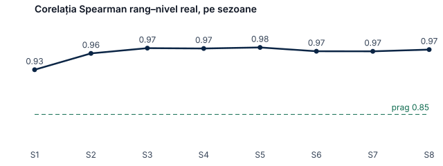
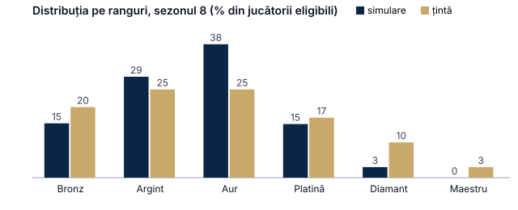

# Raportul simulării ligii

> Generat automat de `packages/league-engine/tools/simulate.py` (sămânța 2027). Configurarea ligii: versiunea 1, valorile implicite din §6.
> Comanda: `uv run python tools/simulate.py --players 500 --matches 50000 --seasons 8 --seed 2027 --level-floor 1.0 --level-master 7.0 --name RAPORT_SIMULARE_FORMULA_INITIALA`
> `LP_total_așteptat = (Nivel − 1.0) / (7.0 − 1.0) × 2000` (§6.6 dă 1,0 și 7,0).

## Pe scurt
- **500 de jucători** cu un „nivel real” ascuns (distribuție normală în jurul nivelului 3,8), **50000 de meciuri** oficiale în **8 sezoane** de 3 luni (80% dublu, 20% simplu, 5% neterminate, 3% de turneu).
- Fiecare jucător pornește de la chestionar (nivelul real ± o eroare de 0,7), trece prin 5 meciuri de plasare și joacă mai ales cu parteneri și adversari de nivel apropiat, ca într-un club real. Nivelul real se schimbă încet (oamenii progresează sau pierd din formă).
- **Corelația dintre rang și nivelul real** (Spearman, jucători eligibili, clasamentul pe dublu): minimum **0.964** după primul sezon (ținta §6.17: ≥ 0,85) → **atinsă**.
- **Inflația LP** (LP total mediu la final de sezon): între 829 și 840, fără creștere de la un sezon la altul (resetarea o ține în frâu).
- **Plasarea:** chestionarul greșește în medie cu **0.53** niveluri; după cele 5 meciuri de plasare, nivelul afișat diferă în medie cu **0.77** de nivelul real, iar după câteva sezoane cu **0.38**. σ inițial folosit: σ0 = 8,33.

## Pe sezoane
| Sezon | Meciuri (cumulat) | Jucători clasați | Eligibili (≥ 12 meciuri) | Spearman rang–nivel real | Spearman nivel afișat–nivel real | LP total mediu | Eroare medie a nivelului |
|---|---|---|---|---|---|---|---|
| 1 | 6250 | 500 | 500 | 0.934 | 0.947 | 834 | 0.82 |
| 2 | 12500 | 500 | 498 | 0.964 | 0.956 | 829 | 0.64 |
| 3 | 18750 | 500 | 500 | 0.974 | 0.964 | 840 | 0.47 |
| 4 | 25000 | 500 | 499 | 0.973 | 0.958 | 835 | 0.39 |
| 5 | 31250 | 500 | 500 | 0.975 | 0.956 | 835 | 0.34 |
| 6 | 37500 | 500 | 500 | 0.968 | 0.941 | 829 | 0.37 |
| 7 | 43750 | 500 | 500 | 0.968 | 0.951 | 830 | 0.36 |
| 8 | 50000 | 500 | 500 | 0.971 | 0.950 | 829 | 0.38 |

## Distribuția pe ranguri (sezonul 8)
| Rang | Simulare | Țintă orientativă (§6.17) |
|---|---|---|
| Bronz | 15.4% | 20% |
| Argint | 28.6% | 25% |
| Aur | 37.8% | 25% |
| Platină | 15.2% | 17% |
| Diamant | 3.0% | 10% |
| Maestru | 0.0% | 3% |

Distribuția pe ranguri urmează, în mare, distribuția nivelurilor reale ale jucătorilor: formula LP (factorul `g`) trage fiecare jucător spre rangul care corespunde nivelului său. Ținta din §6.17 este orientativă; distribuția reală a clubului o vom vedea abia după deschidere. Parametrul care o mută este `LP_total_așteptat` (§6.6); el se poate schimba din configurarea versionată fără cod.

## Exemple de meciuri cu LP calculat (ultimul sezon)
Jucătorii încă în re-plasare (primele 3 meciuri ale sezonului) nu primesc LP, de aceea unele rânduri au mai puțini jucători.

| Meci | p (echipa A, înainte) | Câștigător | w | Tip | ΔLP pe jucător |
|---|---|---|---|---|---|
| j088 + j299 vs j036 + j304 | 0.48 | B | 1.0 | official | j304 +24 |
| j442 + j032 vs j125 + j045 | 0.31 | B | 1.0 | official | j125 +13 |
| j196 + j131 vs j194 + j176 | 0.40 | B | 1.0 | official | j196 -12, j176 +21 |
| j386 + j317 vs j155 + j369 | 0.29 | A | 0.5 | official | j386 +15, j317 +15 |
| j134 + j342 vs j439 + j266 | 0.25 | B | 1.0 | official | j134 -7, j342 -9, j266 +10 |
| j454 + j230 vs j158 + j024 | 0.73 | A | 1.0 | official | j454 +12, j158 -10, j024 -8 |
| j265 + j471 vs j395 + j419 | 0.37 | B | 1.0 | official | j265 -11, j471 -11, j395 +15 |
| j311 + j353 vs j477 + j368 | 0.72 | A | 1.0 | official | j311 +11, j353 +12, j477 -8, j368 -11 |
| j354 + j014 vs j493 + j460 | 0.48 | B | 1.0 | official | j354 -14, j014 -15, j493 +22, j460 +21 |
| j263 + j016 vs j422 + j349 | 0.73 | A | 1.0 | official | j263 +11, j016 +13, j422 -11, j349 -9 |
| j222 + j256 vs j466 + j459 | 0.35 | B | 1.0 | official | j222 -10, j256 -11, j466 +17, j459 +14 |
| j466 + j106 vs j224 + j337 | 0.62 | A | 1.0 | official | j466 +19, j106 +20, j224 -14, j337 -13 |

## Ce verifică simularea (§6.17)
1. Rangul ajunge să reflecte nivelul real (corelația de mai sus).
2. LP nu „se umflă” de la un sezon la altul.
3. Plasarea apropie rapid nivelul afișat de cel real.
4. Resetarea de sezon (LP la 0, MMR comprimat cu 0,75 spre medie, 3 meciuri de re-plasare) nu strică ordinea: corelația revine imediat.
