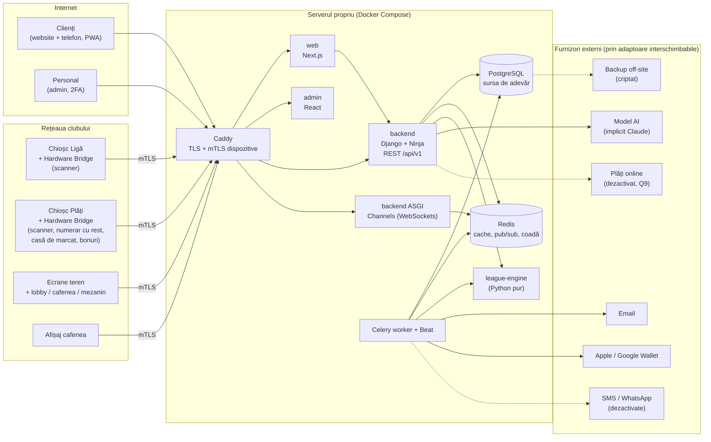
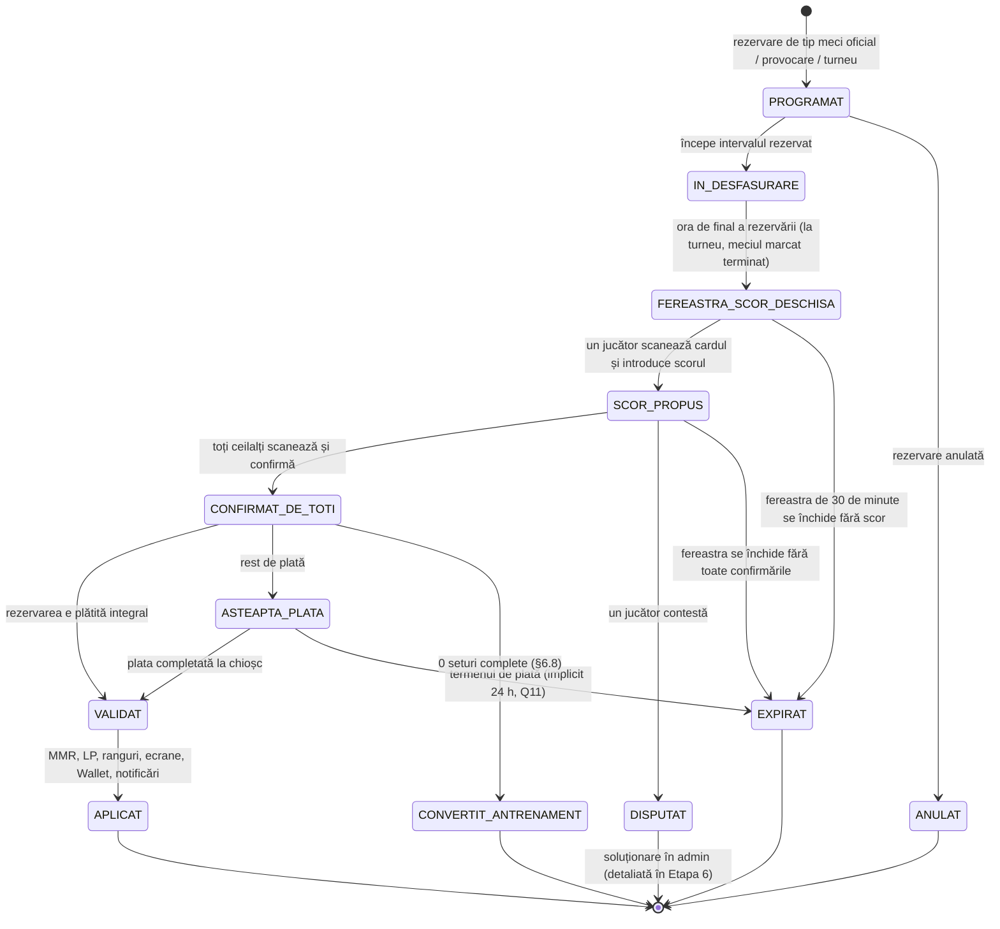
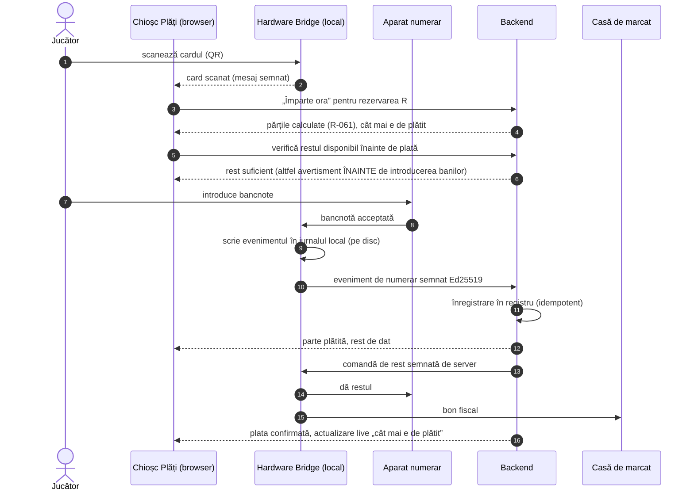

# Diagrame de arhitectură

> Creat în Etapa 0 (26.09.2026). Diagramele sunt **ilustrative**: textul normativ rămâne în [01-arhitectura-sistemului.md](01-arhitectura-sistemului.md), în specificațiile din [aplicatii/](aplicatii/) și în [docs/03-liga/](../03-liga/). Diagramele se văd direct pe GitHub (format Mermaid).

## 1. Sistemul în ansamblu

Backend-ul central este singura sursă de adevăr (§4.1). Toate celelalte aplicații sunt „ferestre” spre aceleași date.

## 2. Fluxul unui meci oficial de ligă (§6.9)

Starea se schimbă doar pe server. Fiecare tranziție verifică independent: rezervarea, scanările la intrarea pe teren, plata (registrul contabil) și dispozitivul (doar Chioșcul Ligă înregistrat).

## 3. Plata împărțită a unei ore, cu numerar (§8.3, R-060, R-061)

Serverul creditează numerarul doar pe baza evenimentelor semnate de Hardware Bridge; comenzile de rest sunt semnate de server (ADR-0013).

