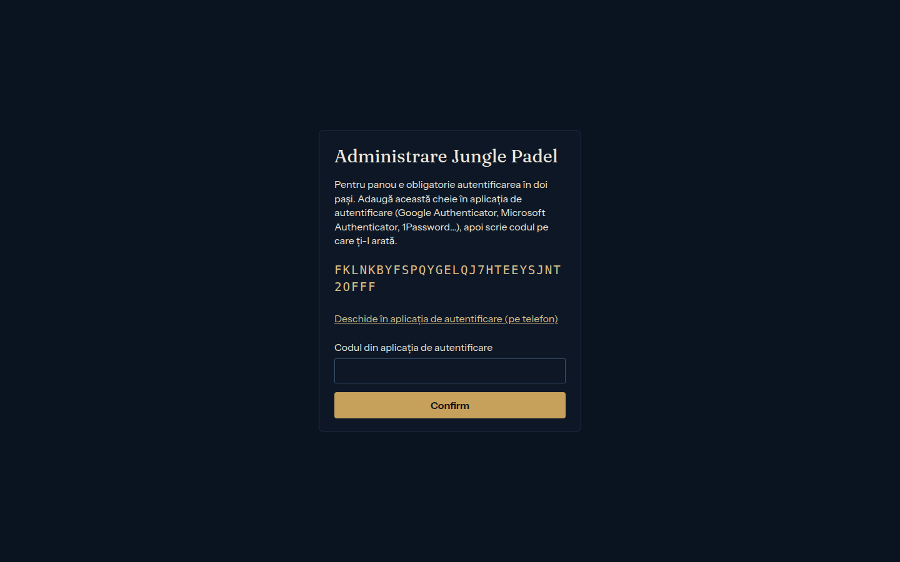
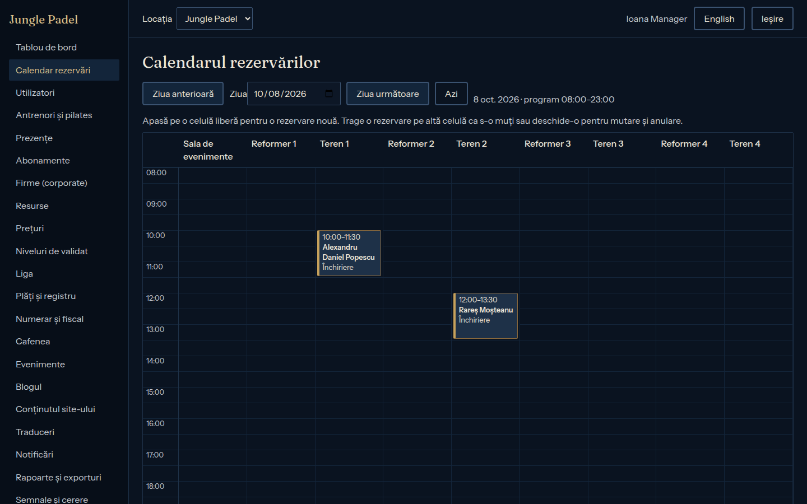
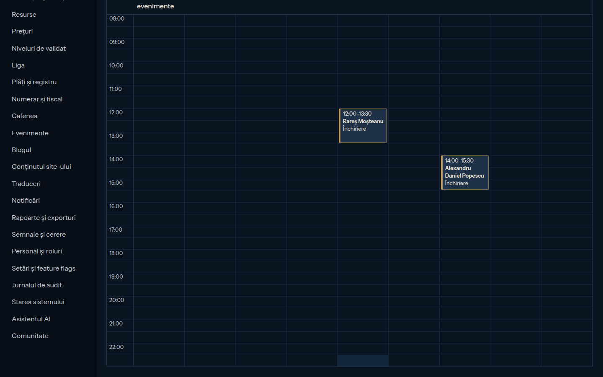

# Ghidul recepției

> Etapa 15, 06.10.2026 (§8.1, Q37). Pentru persoana de la recepție. Panoul se deschide la `https://admin.<domeniu>`, de pe calculatorul recepției. Capturile de ecran sunt făcute pe datele demo; numele și prețurile din ele sunt de test.

## Ce poate face recepția
- caută clienți și face conturi noi;
- face, mută și anulează rezervări;
- trece prezența când un card nu poate fi citit;
- vede plățile;
- preia comenzile cafenelei;
- dă un card nou;
- lucrează cu casa Chioșcului de Plăți (cu PIN-ul personal);
- notează cererea unui client de a nu-i apărea numele pe ecrane.

Ce nu poate face: să schimbe prețuri, să corecteze plăți sau să introducă scoruri. Scorurile se introduc doar la Chioșcul Ligii, de jucători (invariantul 1).

## 1. Intrarea în panou
1. Adresa, emailul și parola voastră.
2. Codul de 6 cifre din aplicația de autentificare de pe telefon (2FA). La prima intrare, panoul vă arată un cod QR de scanat cu aplicația.

## 2. Calendarul rezervărilor
**Calendar rezervări** arată ziua cu toate terenurile. Butoanele „Ziua anterioară” și „Azi” schimbă ziua.

- **Rezervare nouă:** apăsați pe o celulă liberă, alegeți **Clientul**, **Tipul** și **Durata** (minimum 60 de minute), apoi **Rezerv**. Panoul arată prețul.
- **Mutare:** trageți rezervarea pe altă celulă, sau deschideți-o și apăsați **Mut rezervarea**.

  
- **Anulare:** deschideți rezervarea, apoi **Anulez rezervarea**.
  - Cu cel puțin 24 de ore înainte, anularea e fără cost.
  - Cu mai puțin de 24 de ore, se plătește. Excepția **Fără taxă de anulare** o aprobă doar managerul.

## 3. Clientul nou, la recepție
**Utilizatori → Cont nou la recepție**: numele, telefonul și emailul (dacă are), apoi **Creez contul**. Clientul primește emailul de confirmare. Cardul îl găsiți în fișa lui (**Card nou** → de tipărit la recepție).

## 4. Un card pierdut sau care nu se citește
- **Card pierdut:** în fișa clientului → **Blochez cardul**, apoi **Card nou**.
- **Cardul nu se citește la intrare:** **Prezențe → Prezență trecută manual**: persoana, ce treceți (sosire, teren, clasă), **Trec prezența**. Se înregistrează ca o scanare, cu numele vostru.

## 5. Plata
- Clienții plătesc la **Chioșcul de Plăți**, în numerar, cu rest și bon fiscal. Ora de teren se poate împărți între jucători la chioșc.
- Recepția nu încasează în mod obișnuit. O excepție (de exemplu, chioșcul în pană) o trece managerul, cu motiv.

## 6. Casa chioșcului (modul personal)
1. **Numerar și fiscal → PIN-ul meu pentru chioșc**: alegeți un PIN de 6 cifre, o singură dată.
2. La chioșc: scanați cardul vostru, apoi PIN-ul. Apar operațiunile: alimentarea restului, golirea, numărarea, închiderea zilei (raportul Z).
3. Orice diferență la numărare apare în panou, la manager.

## 7. Cafeneaua
- **Cafenea → Comenzile**: comenzile plătite la chioșc, în ordine. Afișajul cafenelei le arată și clienților.
- O comandă la bar, plătită în numerar, e o excepție: se trece în **Cafenea → Comandă la bar**, cu motiv.

## 8. „Nu vreau să apar pe ecrane”
În fișa clientului → **Nu mai afișa numele pe ecrane**. De acum apare „Jucător” (Q55).

## Când chemați managerul
- o plată sau o anulare contestată;
- un jucător blocat după neprezentări;
- un aparat care nu răspunde după 10 minute (managerul primește oricum mesaj);
- o dispută de scor.
