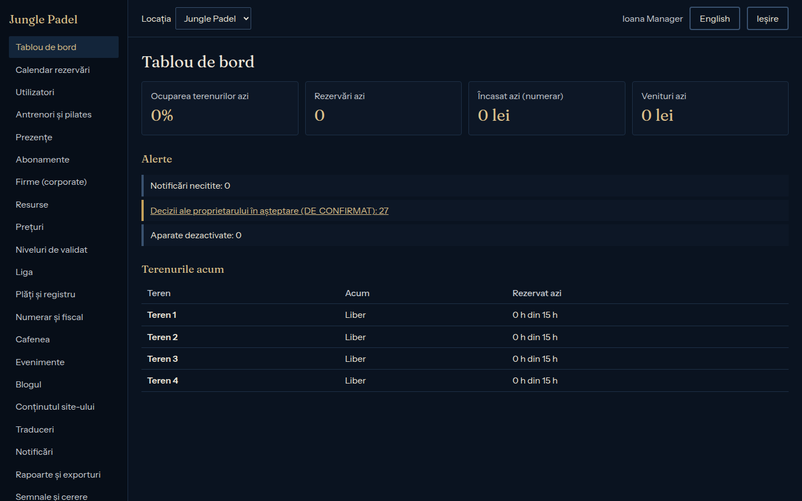
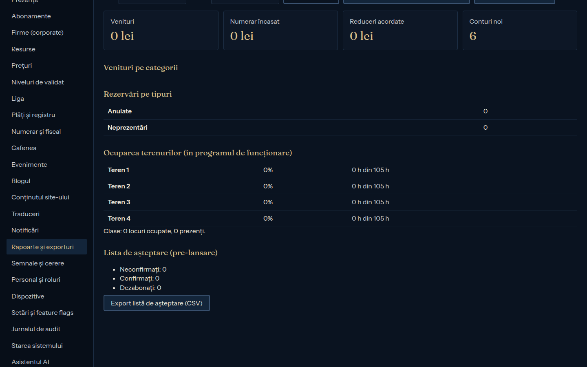
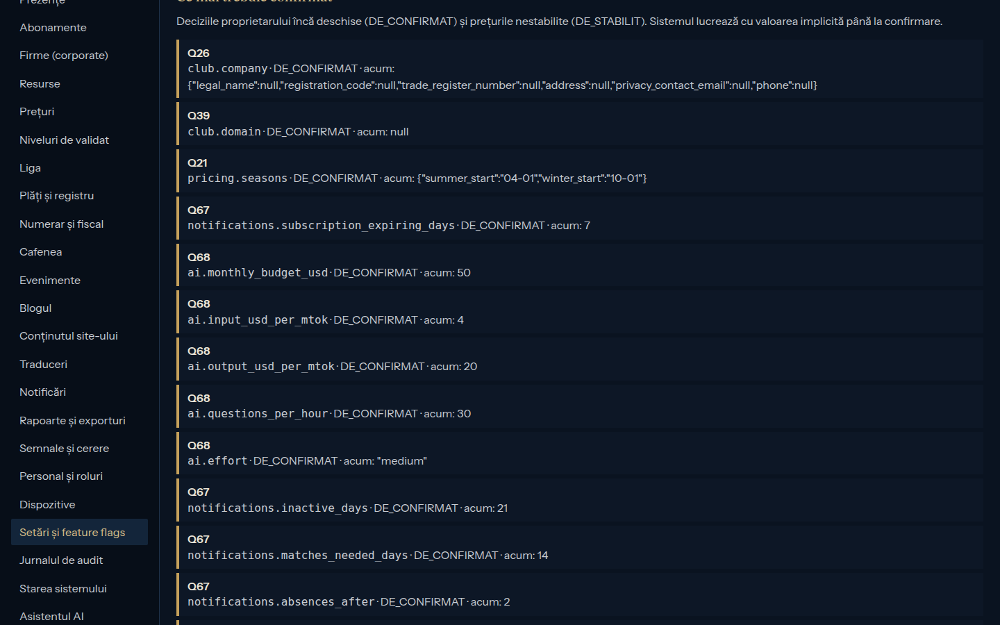
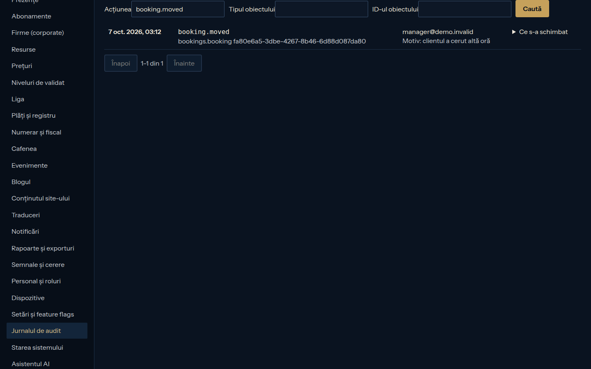
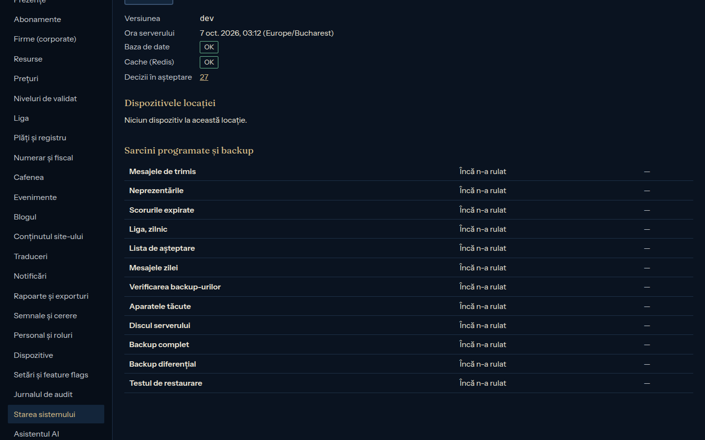

# Ghidul managerului

> Etapa 15, 06.10.2026 (§8.1, §8.6). Managerul face tot ce fac recepția și antrenorii, plus deciziile clubului. Panoul: `https://admin.<domeniu>`, cu 2FA.

## Zilnic (10 minute)
1. **Tablou de bord**: ocuparea terenurilor azi, rezervările, alertele.

   
2. **Prezențe → Notificări pentru personal**: neprezentările și ce s-a întâmplat la intrări. Alertele aparatelor, ale discului și ale backup-ului vin pe email și push.
3. **Liga → Meciuri de decis**: disputele. Decideți doar ce se întâmplă cu un scor propus (**Aplic scorul**, **Redeschid**, **Anulez meciul**), cu motiv. Scorul nu-l scrieți voi.
4. **Numerar și fiscal**: casa chioșcului; o diferență la numărare se vede aici.

## Săptămânal
- **Semnale și cerere:** ce ar merita o privire (meciuri repetate, corecturi, diferențe de casă), cât de pline au fost terenurile, cu propuneri de preț, și NPS-ul.
- **Comunitate:** ciornele de mesaje scrise de AI, „De revizuit”. Le citiți, le corectați și abia apoi le folosiți.
- **Rapoarte și exporturi:** încasările pe categorii, ocuparea, exportul CSV pentru contabil.

  

## Banii
- **Plăți și registru:** registrul zilei. O greșeală nu se șterge: se corectează cu **Corectez (înregistrare inversă)**, cu motiv. Corecția apare în jurnal, cu numele vostru.
- **Vouchere:** **Voucher nou**: clientul, tipul, valoarea, valabilitatea.
- **Prețuri:** prețul pe bandă orară, cu motiv. Se aplică rezervărilor noi.

## Clubul
- **Antrenori și pilates**, **Resurse** (terenuri, sala, aparatele), **Evenimente** (calendarul public), **Blogul**, **Conținutul site-ului**.
- **Setări și feature flags:** comutatoarele (site-ul complet, efectele, AI-ul). Fiecare schimbare cere motiv.

  
- **Jurnalul de audit:** cine, ce, când și de ce, pentru orice schimbare importantă.

  
- **Starea sistemului:** versiunea, baza de date, aparatele, sarcinile programate și backup-urile.

  

## Ce nu face nimeni din panou
- **Scorurile** se introduc doar la Chioșcul Ligii (invariantul 1).
- **Datele unui client** se văd doar cât e nevoie. Ștergerea contului (GDPR) e definitivă; o face doar managerul, la cererea clientului.
